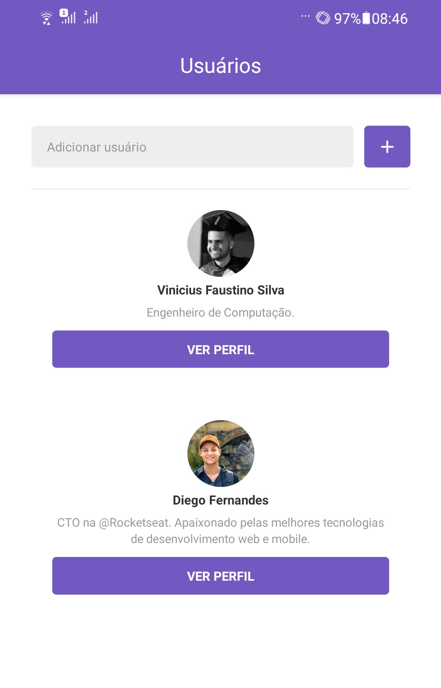
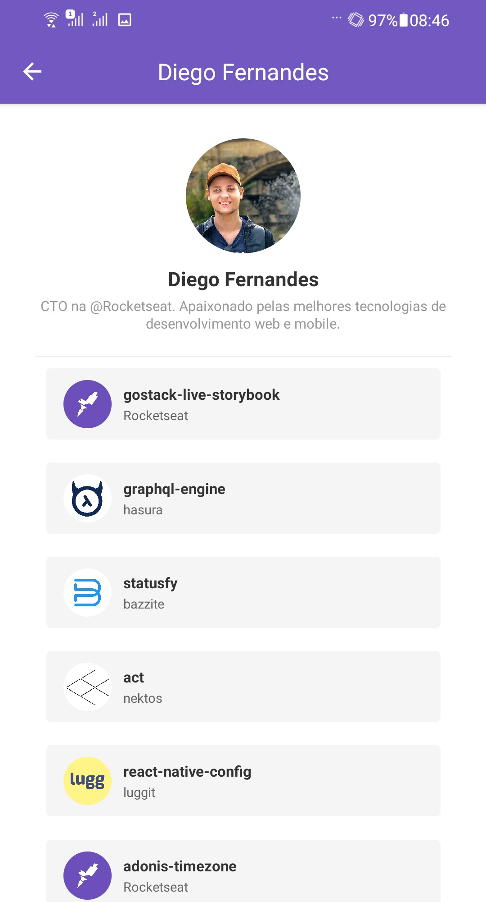
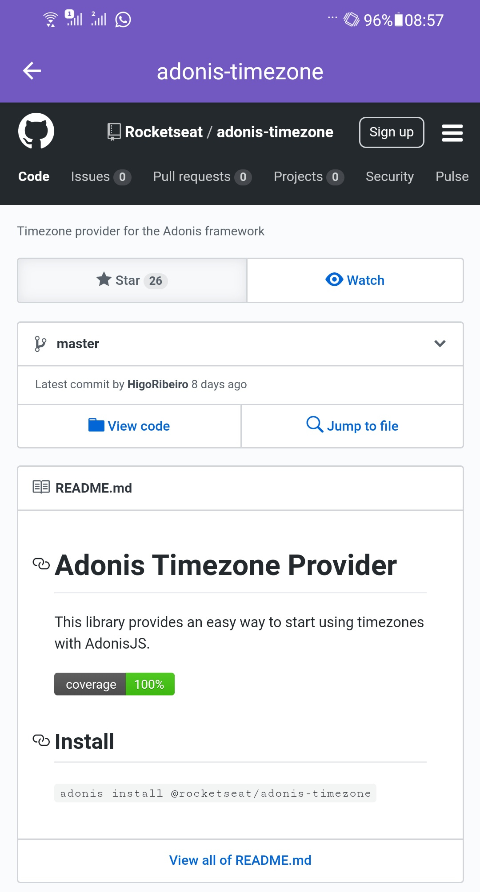

<h1 align="center">
  
   
   
  Desafio 6: Primeiro projeto com React Native
</h1>

  <a href="#rocket-sobre-o-desafio">Sobre o desafio</a>&nbsp;&nbsp;&nbsp;|&nbsp;&nbsp;&nbsp;
  <a href="#wrench-conceitos">Conceitos</a>&nbsp;&nbsp;&nbsp;|&nbsp;&nbsp;&nbsp;
  <a href="#computer-telas">Telas</a>&nbsp;&nbsp;&nbsp;|&nbsp;&nbsp;&nbsp;
  <a href="#memo-license">License</a>

## :rocket: Sobre o desafio

Nesse desafio foi construído uma aplicação utilizando **React Native** onde o usuário coloca o nome dos usuários do github que deseja e estes ficam salvos no AsyncStorage e listados na tela inicial. É possível ver os repositórios com estrelas do usuário clicando no perfil que deseja ver, onde é direcionado para uma view que contem, além de algumas informações do perfil do usuário, os repositórios que ele deu star, onde, clicando em algum repositório, será gerado uma webview com o source do repositório.

## :wrench: Conceitos

Aplicação desenvolvida utilizando **ReactJS** e seus conceitos:

- Scroll infinito
- Pull to refresh
- WebView
- E muito mais ...

## :computer: Telas

- Tela principal

<h1 align="center">
  
</h1>

- Tela com detalhes e repositórios com star

<h1 align="center">
  
</h1>

- WebView com source do repositório

<h1 align="center">
  
</h1>

## :memo: License

Esse projeto está sob a licença MIT. Veja o arquivo [LICENSE](LICENSE.md) para mais detalhes.

---

Feito com ♥ by Vinicius Faustino Silva :wave: [Get in touch!](https://www.linkedin.com/in/vinícius-silva-019aa0165)
